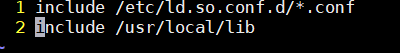
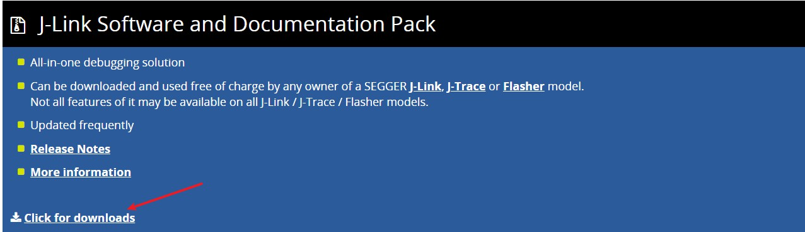
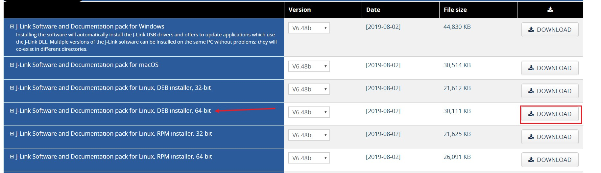
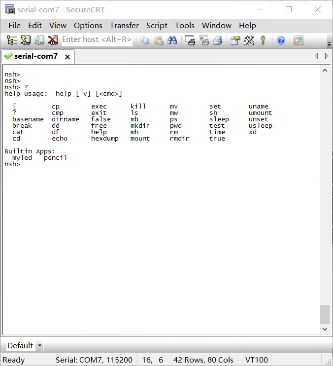

# Nuttx

学习Nuttx操作系统的笔记，首先是搭建Linux下的开发环境

## 一.搭建环境 

首先是Nuttx代码下载地址：[Nuttx](https://bitbucket.org/nuttx/)  
推荐两篇关于Nuttx写的非常好的文章  
https://github.com/liaowanglw/Nuttx  
https://julyrain.me/2018/08/05/使用nuttx/  
这两篇文章给我很多帮助，网上关于Nuttx的文章非常少，经过一段时间摸索，可以正常使用了，非常开心，特此记录。  

### 1.代码下载
创建Nuttx文件夹（此目录称为根目录），通过git仓库下载核心组件：  
git clone https://bitbucket.org/nuttx/nuttx.git nuttx（下载操作系统内核源码）  
git clone https://bitbucket.org/nuttx/apps.git apps（下载操作系统builtin app）  
git clone https://bitbucket.org/nuttx/tools.git tools（nuttx的一些工具） 
 
其他可选组件：  
git clone https://bitbucket.org/nuttx/buildroot.git buildroot（nuttx提供的build工具）  
git clone https://bitbucket.org/nuttx/nxwidgets.git NxWidgets（nuttx提供的图形化界面）  
git clone https://bitbucket.org/nuttx/pascal.git Pascal（nuttx提供的pascal脚本解析器）  
git clone https://bitbucket.org/nuttx/uclibc.git uClibc++（nuttx提供的c++ stl库）    

比如我下载的版本是7.30，完成之后的界面：  
  
	
	注意：nuttx和apps都需要去掉后面的版本号，否则编译会报错。  

### 2.安装ARM Toolchain  

``` sudo apt-get install gcc-arm-none-eabi ```  
切换路径到我们新建的Nuttx根目录，  
``` cd Nuttx/tools/kconfig-frontends ```  
编译kconfig-frontends  
``` ./configure --enable-mconf ```  
``` make ```  
``` make install ```  

	注意：如果提示权限不够需要加上sudo命令  
	
修改配置文件：  
``` sudo vim /etc/ld.so.conf ```  
在最后一行添加：  
``` include /usr/local/lib ```  
如下图所示：  
  
终端执行：  
``` ldconfig ```  
至此配置工具安装完成，可以开始编译Nuttx系统了。  


### 3.配置、编译及下载到开发板  
进入到根目录:  
``` cd Nuttx/nuttx/configs ```  
```configs```目录下的型号就是nuttx操作系统默认支持的型号，因为手上刚好有正点原子STM32F429IGT6的开发板，所以我选择``` stm32f429i-disco ```作为说明。 

首先确认晶振频率，原子f429的开发板是25MHZ，使用USART1(即PA9,PA10)，配频到最大168MHZ  
时钟配置在``` configs/stm32f429i-disco/include/board.h ```下：  
  
需要修改的地方，已经子在图上标注出来了。时钟配置完成之后就开始配置nuttx工程，先实现一个小目标：``` 使用串口1输出nsh、有/proc文件系统 ```  

#### 第一步：nsh的配置  
进入```nuttx```代码目录下的```tools```目录，路径：
``` Nuttx/nuttx/tools ```  
在终端输入：  
``` ./configure.sh stm32f429i-disco/nsh ```  
接下来会显示完成  
``` 
copy file  
Refreshing...
 ```
这一步的作用主要是将``` configs/stm32f429i-disco/nsh/defconfig ```拷贝成``` .config ```，给下一步``` make menuconfig ```使用  
主要配置如下：  
``` 
Build Setup  --->
    Build Host Platform (Linux)  --->
        (X) Linux
        构建平台为Linux
    Binary Output Formats  --->
        [*] Intel HEX binary format
        输出hex
        [*] Raw binary format
        输出bin

System Type  --->
    STM32 Peripheral Support  --->
        [*] USART1
        使能外设USART1
    U[S]ART Configuration  --->
        Serial Driver Configuration  --->
            [*] Disable reordering of ttySx devices.
            这个选项的作用是，禁止重新排序ttySx设备文件
            如果不禁用这个，ttyS1永远指向作为终端的串口
            也就是说，如果USART3是终端，ttyS1就指向USART3，而不是USART1

RTOS Features  --->
    RTOS hooks  --->
        [*] Custom board/driver initialization
        这个选项的作用是，调用客户定制的初始化，不然是注册不了驱动的

Device Drivers  --->
    [*] Serial Driver Support  --->
        Serial console (USART1)  ---> 
            (X) USART1
            串口1作为终端
        USART1 Configuration  --->
           (115200) BAUD rate   波特率
           (8) Character size   数据位
           (0) Parity setting   校验位
           (0) Uses 2 stop bits 停止位

File Systems  --->
    [*] PROCFS File System
    支持/proc

Application Configuration  --->
    Examples  --->
        [*] "Hello, World!" example
        (100) Hello task priority
        (2048) Hello stack size
        添加一个helloworld应用
```
到这里，我们需要的最小系统会配置完成了  

	1.驱动串口1，115200,8,n,1  
	2.nsh终端从串口1输出  
	3.支持proc文件系统  
	
通过文档说明，我们知道默认配置的串口1就是PA9和PA10，所以串口引脚不用改。

#### 第二步：使用arm-none-eabi-gcc编译  
我使用的Linux操作系统是Ubuntu16.04,首先安装交叉编译链。可以使用安装包在添加全局变量，也可以是直接安装，这里直接安装。  
``` sudo apt-get install gcc-arm-none-eabi ```  
安装完成之后，测试下交叉编译链：  
``` arm-none-eabi-gcc --version ```  
如果成功安装，会显示安装版本信息等。  
安装完成之后，首先运行:  
``` make oldconfig ```  
会生成.config配置文件，在运行：  
``` make ```  
编译完成之后，会生成``` nuttx.bin ```和``` nuttx.hex ```文件  

#### 第三步：使用JLink下载到开发板上  
本人使用JLink v9，先到官网下载驱动：  
[SEGGER](https://www.segger.com/downloads/jlink/#J-LinkSoftwareAndDocumentationPack)   
进入官网的页面，首先找到：  
  
然后选择下载版本，本人使用Ubuntu16.04,所以选择DEB格式（根据自己linux版本选择正确安装包):  
  
 
JLink安装完成之后通过``` JLinkExe ```命令下载。  
下面是使用的配置文件jlink.cfg:  
```
device stm32f407ig
r
h
erase
loadbin ./nuttx.bin,0x08000000
g
exit
```  
指令含义如下：  
```  
Device     Selects a specific device J-Link shall connect to
           and performs a reconnect.
r          Reset target         (RESET)
h          halt
erase      Erase internal flash of selected device. Syntax: Erase
loadbin    Load *.bin file into target memory.
           Syntax: loadbin <filename>, <addr>
g          go
```  
下载nuttx.bin文件，jlink.cfg和nuttx.bin放到一起，即根目录下：``` Nuttx/nuttx ```代码目录下：  
``` JLinkExe jlink.cfg ```  
然后根据提示选择```S```(我使用JLink的SWD下载)，然后在回车，就可以下载了。  
下载完成之后，重新启动开发板，接上串口，回车之后姐可以看到``` nsh> ```提示符，输入``` ? ```号回车，可以显示很多提示内容： 
  
至此基本环境先告一段落  